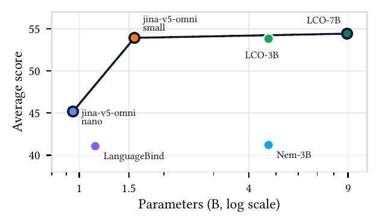
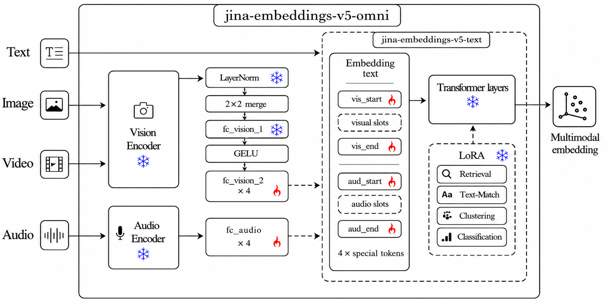

<br><br>

<p align="center">

</p>


### **jina-embeddings-v5-omni-small**: Multi-Task Omni Embedding Base (Small)

[ArXiv](https://arxiv.org/abs/2605.08384) | [Blog](https://www.elastic.co/search-labs/blog/jina-embeddings-v5-omni-all-media-one-index)


<p align="center">

</p>

*Average score vs. parameter count across image (MIEB-Lite), video (MMEB-V), and audio (MAEB) benchmarks — `jina-v5-omni-nano` and `jina-v5-omni-small` define the open-weight frontier (Table 1 in the [ArXiv report](https://arxiv.org/abs/2605.08384)).*



### Model Overview

`jina-embeddings-v5-omni-small` is a multimodal embedding model that accepts **text, images, video, and audio** and produces embeddings in a shared vector space aligned with the text-only [`jinaai/jina-embeddings-v5-text-small`](https://huggingface.co/jinaai/jina-embeddings-v5-text-small) — so you can index with text and query with any modality, no reindexing. For a more compact alternative, see [`jinaai/jina-embeddings-v5-omni-nano`](https://huggingface.co/jinaai/jina-embeddings-v5-omni-nano).

This is the **base** repository — it holds all task adapters (retrieval, classification, clustering, text-matching). For a single task, pre-merged task-specific variants are also available:
- [`jinaai/jina-embeddings-v5-omni-small-retrieval`](https://huggingface.co/jinaai/jina-embeddings-v5-omni-small-retrieval) — query–document semantic search and RAG (raw-transformers users prepend `Query: ` / `Document: ` to text; sentence-transformers users call `encode_query()` / `encode_document()`).
- [`jinaai/jina-embeddings-v5-omni-small-classification`](https://huggingface.co/jinaai/jina-embeddings-v5-omni-small-classification) — assigning labels via embedding similarity — zero-shot and few-shot classification across modalities.
- [`jinaai/jina-embeddings-v5-omni-small-clustering`](https://huggingface.co/jinaai/jina-embeddings-v5-omni-small-clustering) — grouping semantically similar items — topic discovery, deduplication, exploratory analysis.
- [`jinaai/jina-embeddings-v5-omni-small-text-matching`](https://huggingface.co/jinaai/jina-embeddings-v5-omni-small-text-matching) — symmetric pairwise similarity scoring — STS, paraphrase and near-duplicate detection.

| Feature | Value |
| --- | --- |
| Parameters | ~1.74B |
| Embedding Dimension | 1024 |
| Supported Tasks | `retrieval`, `classification`, `clustering`, `text-matching` |
| Max Sequence Length | 32768 |
| Pooling Strategy | Last-token |
| Supported Inputs | text, image, video, audio |
| Supported File Types | images: `.jpg`, `.jpeg`, `.png`, `.gif`, `.webp`, `.bmp`, `.tif`, `.tiff`, `.avif`, `.heic`, `.svg`; video: `.mp4`, `.avi`, `.mov`, `.mkv`, `.webm`, `.flv`, `.wmv`; audio: `.wav`, `.mp3`, `.flac`, `.ogg`, `.m4a`, `.opus`; documents: `.pdf` |
| Matryoshka Dimensions | 32, 64, 128, 256, 512, 768, 1024 |

### Via Elastic Inference Service

The fastest way to use v5-omni in production. [Elastic Inference Service (EIS)](https://www.elastic.co/docs/explore-analyze/elastic-inference/eis) provides managed embedding inference with built-in scaling, so you can generate embeddings directly within your Elastic deployment.

```bash
# Retrieve the configuration of the preconfigured omni-small inference endpoint
GET /_inference/embedding/.jina-embeddings-v5-omni-small

# Generate an embedding for a single piece of text using the predefined endpoint
POST _inference/embedding/.jina-embeddings-v5-omni-small
{
  "input": [
    "This is a test"
  ]
}

# Fuse a text description and an image into a single embedding via a multimodal content block
POST _inference/embedding/.jina-embeddings-v5-omni-small
{
  "input": [
    {
      "content": [
        { "type": "text",  "value": "A small blue square" },
        { "type": "image", "format": "base64", "value": "<BASE64_IMAGE_DATA>" }
      ]
    }
  ]
}

# Create a custom endpoint that truncates omni-small embeddings to 32 dimensions
PUT _inference/embedding/jina-omni-small-32d
{
  "service": "elastic",
  "service_settings": {
    "model_id": "jina-embeddings-v5-omni-small",
    "dimensions": 32
  }
}
```

See the [Elastic Inference Service documentation](https://www.elastic.co/docs/explore-analyze/elastic-inference/eis) for setup details.

### Install

```bash
# core
pip install transformers torch pillow numpy

# Optional — install only the extras for the modalities you actually use:
pip install librosa soundfile      # audio decoding
pip install torchcodec                # video decoding for proc(videos=path) (transformers default backend)
pip install av imageio imageio-ffmpeg # video decoding for SentenceTransformer model.encode("clip.mp4") and np.ndarray video inputs
pip install pdf2image pypdfium2    # PDF rendering
pip install cairosvg pillow    # SVG rendering
pip install "vllm==0.20.1"        # high-throughput serving (validated)
pip install sentence-transformers  # one-call multimodal API
```

For minimum versions see the Requirements section below (transformers >= 4.57, torch >= 2.5; vLLM path validated with vllm == 0.20.1).

### Quickstart

```python
from PIL import Image
import librosa, torch
from transformers import AutoModel, AutoProcessor, WhisperFeatureExtractor

repo = "jinaai/jina-embeddings-v5-omni-small"
model = AutoModel.from_pretrained(repo, trust_remote_code=True, default_task="retrieval").eval()
proc  = AutoProcessor.from_pretrained(repo, trust_remote_code=True)

# model.embed(**inputs) returns L2-normalized last-token embeddings.
t_vec = model.embed(**proc(text="Query: Which planet is known as the Red Planet?", return_tensors="pt").to(model.device))
i_vec = model.embed(**proc(images=Image.open("photo.jpg"), text="<|vision_start|><|image_pad|><|vision_end|>", return_tensors="pt").to(model.device))
v_vec = model.embed(**proc(videos="clip.mp4", text="<|vision_start|><|video_pad|><|vision_end|>", return_tensors="pt").to(model.device))
# Needs torchcodec or torchvision. On Windows or envs without either, use model.encode("clip.mp4") from the sentence-transformers section below (av-only, no codec libs required).

# Audio has no string placeholder — build token ids from config.
audio, _ = librosa.load("speech.wav", sr=16000)
feat = WhisperFeatureExtractor(feature_size=128)(audio, sampling_rate=16000, return_tensors="pt")["input_features"]
cfg = model.config
n   = feat.shape[-1] // 4
ids = torch.tensor([[cfg.audio_start_token_id, *[cfg.audio_token_id]*n, cfg.audio_end_token_id]])
a_vec = model.embed(
    input_ids=ids.to(model.device),
    attention_mask=torch.ones_like(ids).to(model.device),
    input_features=feat.to(model.device, dtype=next(model.parameters()).dtype),
)
```

For retrieval, use `encode_query()` for query-side embeddings and `encode_document()` for document-side embeddings. A bare `encode(text)` call does not know which retrieval side you intended. This applies to **every modality**, not just text: to encode an image, video, or audio clip as a query or document, either prepend the same `Query: ` / `Document: ` prefix to the text alongside the media placeholder on the raw path (e.g. `text="Query: <|vision_start|><|image_pad|><|vision_end|>"`), or pass the media straight to `encode_query(...)` / `encode_document(...)` via `sentence-transformers`.

For non-retrieval tasks (classification / clustering / text-matching), load with `default_task="classification"` (or the matching task) and prepend `"Document: "` to text inputs on the raw `model.embed(...)` path — e.g. `proc(text="Document: A cute cat sitting on a mat.", return_tensors="pt")`. These tasks have no query/document distinction; the `Document: ` prefix is the only one used.

No `dtype`, `device`, `min_pixels`, or custom pooling code needed — sensible defaults live in the model config (bf16 weights, 256–1280 vision tokens).

<details>
<summary>Requirements</summary>

- `transformers>=4.57` (recommend >=5.1 for the small variants)
- `torch>=2.5`

Optional:
- `sentence-transformers` — one-call API for all 4 modalities
- `librosa` — audio decoding
- `torchcodec` (or `torchvision`) — video decoding when calling `proc(videos=…)` directly (transformers' video processor selects torchcodec by default, falling back to torchvision)
- `av` — video decoding via `model.encode("clip.mp4")` (SentenceTransformer path) and for in-memory `np.ndarray` video inputs
- `vllm==0.20.1` — high-throughput serving; H100 deployments may also need DeepGEMM installed for vLLM FP8 kernels

</details>

### Selective Modality Loading

By default all components (vision + audio towers + text encoder) are loaded.
To save memory, pick a subset — the unused towers are skipped at load time:

```python
from transformers import AutoModel

AutoModel.from_pretrained("jinaai/jina-embeddings-v5-omni-small", trust_remote_code=True, modality="omni")    # all (default)
AutoModel.from_pretrained("jinaai/jina-embeddings-v5-omni-small", trust_remote_code=True, modality="vision")  # vision + text
AutoModel.from_pretrained("jinaai/jina-embeddings-v5-omni-small", trust_remote_code=True, modality="audio")   # audio + text
AutoModel.from_pretrained("jinaai/jina-embeddings-v5-omni-small", trust_remote_code=True, modality="text")    # text only
```

Same parameter works via `sentence-transformers`:

```python
SentenceTransformer("jinaai/jina-embeddings-v5-omni-small", trust_remote_code=True, model_kwargs={"modality": "vision"})
```

### Via sentence-transformers

```python
from sentence_transformers import SentenceTransformer

# Base repo holds all 4 task adapters — pick one at load time.
model = SentenceTransformer(
    "jinaai/jina-embeddings-v5-omni-small",
    trust_remote_code=True,
    model_kwargs={"default_task": "retrieval"},
)

# URLs, local paths (with or without extension), PIL.Image, np.ndarray,
# torch.Tensor, bytes, and BytesIO are all accepted directly.
q_vec = model.encode_query("Which planet is known as the Red Planet?")
d_vec = model.encode_document("Mars is often referred to as the Red Planet due to its reddish appearance.")

# The Query:/Document: distinction applies to EVERY modality, not just text —
# pass the image / video / audio (URL, path, or object) straight to
# encode_query() / encode_document() to encode it as that retrieval side:
img_as_document = model.encode_document("https://huggingface.co/datasets/huggingface/documentation-images/resolve/main/transformers/tasks/car.jpg")
img_as_query    = model.encode_query("https://huggingface.co/datasets/huggingface/documentation-images/resolve/main/transformers/tasks/car.jpg")
i_vec = model.encode("https://huggingface.co/datasets/huggingface/documentation-images/resolve/main/transformers/tasks/car.jpg")
v_vec = model.encode("https://huggingface.co/datasets/raushan-testing-hf/videos-test/resolve/main/sample_demo_1.mp4")  # needs `pip install av`
a_vec = model.encode("https://huggingface.co/datasets/Narsil/asr_dummy/resolve/main/mlk.flac")  # needs `pip install librosa soundfile`

# Fused multimodal — a tuple becomes ONE embedding in a single forward pass:
emb = model.encode(("Winter boots, waterproof leather upper",
                    "https://.../boot.jpg",
                    "https://.../boot.mp4"))
```

For non-retrieval tasks (classification / clustering / text-matching), reload
with the corresponding `default_task` and use `encode_document(...)` (or
`encode(text, prompt_name="document")`) — a bare `encode(text)` does not
apply the `"Document: "` prefix and is off-distribution.

No `dtype`, `device`, `min_pixels`, or custom pooling code needed — sensible defaults live in the model config (bf16 weights, 256–1280 vision tokens).

<!-- VIDEO_INPUT_TYPES_DETAILS -->
<details><summary>Accepted video inputs</summary>

Path (`.mp4 .avi .mov .mkv .webm .flv .wmv`, or extensionless — content-sniffed), HTTP(S) URL, `bytes`/`io.BytesIO`, and in-memory `np.ndarray` / `torch.Tensor` of shape `(T, H, W, 3|4)` with dtype `uint8`. In-memory arrays are encoded to MP4 on the fly (needs `pip install imageio imageio-ffmpeg`).

```python
import numpy as np
# (T, H, W, 3) uint8 — e.g. from decord, imageio, or an rgb frame buffer
frames = np.zeros((16, 224, 224, 3), dtype=np.uint8)
v_vec = model.encode(frames)
```

</details>

### Via vLLM

The base repo holds all 4 task adapters. Pick **one task per vLLM instance** via `hf_overrides`:

```python
from vllm import LLM
llm = LLM(
    model="jinaai/jina-embeddings-v5-omni-small",
    runner="pooling",
    trust_remote_code=True,
    hf_overrides={"task": "retrieval"},  # or: classification / clustering / text-matching
)
# Retrieval: prepend "Query: " for queries, "Document: " for documents.
# Non-retrieval (classification / clustering / text-matching): prepend "Document: " to every text input.
outs = llm.embed([{"prompt": "Query: Which planet is known as the Red Planet?"}])
```

Or via CLI:

```bash
vllm serve jinaai/jina-embeddings-v5-omni-small \
  --trust-remote-code \
  --hf-overrides '{"task": "retrieval"}'
```

Alternatively set `JINA_V5_TASK=retrieval` in the environment. Output is bit-exact
with the corresponding pre-merged `-retrieval` / `-classification` / `-clustering` /
`-text-matching` variant.

### Matryoshka (truncating embeddings)

All three backends support truncating the full embedding to a shorter dimension
with L2 re-normalization, so the result stays unit-norm:

```python
# transformers
vec = model.embed(truncate_dim=256, **proc(text="hello", return_tensors="pt"))
# or
vec = model.encode(["hello"], task="retrieval", truncate_dim=256)

# sentence-transformers
vec = model.encode("hello", truncate_dim=256)

# vLLM — ask the pooler for a smaller embedding
from vllm import PoolingParams
outs = llm.embed(prompts, pooling_params=PoolingParams(dimensions=256))
# or truncate + renormalize the full-dim output yourself:
import numpy as np
full = np.asarray(outs[0].outputs.embedding)
vec = full[:256] / np.linalg.norm(full[:256])
```

<!-- BATCHING_SECTION_START -->
### Batching

Pass a list to encode many inputs in one call.

```python
# sentence-transformers — any modality
t_vecs = model.encode(["query 1", "query 2"])
i_vecs = model.encode([Image.open("a.jpg"), Image.open("b.jpg")])
v_vecs = model.encode(["clip1.mp4", "clip2.mp4"])
a_vecs = model.encode(["speech1.wav", "speech2.wav"])

# raw transformers — text (native padded batch)
inputs = proc(text=["query 1", "query 2"], padding=True, truncation=True, return_tensors="pt").to(model.device)
vecs = model.embed(**inputs)  # (2, dim)

# vLLM — list of request dicts, any modality
outs = llm.embed([
    {"prompt": "query 1"},
    {"prompt": "query 2"},
])
```

For `sentence-transformers`, images / video / audio are forwarded per-sample (one forward pass each). Text is truly batched. For large-scale multimodal throughput, prefer `vLLM`.

<!-- BATCHING_SECTION_END -->

### Compatibility

Embeddings produced by this model share a vector space with:
- [`jinaai/jina-embeddings-v5-text-small`](https://huggingface.co/jinaai/jina-embeddings-v5-text-small) — text-only
- `jinaai/jina-embeddings-v5-text-small` (via matching adapter)

You can index text with the `v5-text-small` model and query it with image,
video, or audio embeddings from `jina-embeddings-v5-omni-small` — no reindexing.

### License

CC BY-NC 4.0. For commercial use, [contact us](mailto:sales@jina.ai).
